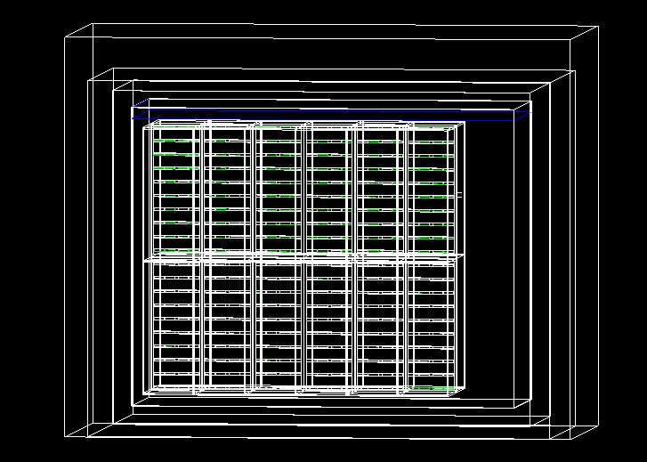

# GEANT4 with GDML + Opticks Simulation Example

## Overview
This repository provides a **hybrid CPU–GPU simulation environment** integrating:
- **[Geant4](https://geant4.web.cern.ch/):** Particle transport and detector simulation
- **[Opticks](https://bitbucket.org/simoncblyth/opticks/src/master/):** GPU-accelerated optical photon simulation

The workflow enables **fast optical photon propagation on GPUs** while retaining Geant4’s CPU-based handling of all other particles.

---

## ⚙️ Prerequisites
- **CUDA Toolkit 13 Update 2 (Tested)**
- **NVIDIA GPU with OptiX support (9) (Tested)**
- **Geant4 (with GDML support enabled)**
- **Opticks**
- **ROOT (for output handling and visualization)**

---

## 🛠️ Installation

### 1. Clone Repositories
```bash
git clone https://github.com/nuRiceLab/OpticalSims
cd OpticalSims
```
### 2. Compile
```bash
mkdir build && cd build && cmake -DWith_Opticks=true -DWITH_GEANT4_VIS=true ..
make -j2
```
### 3. Run in Interactive Mode
./gdml_det i GDML/dune10kt_v5_refactored_1x2x6_nowires.gdml g04.mac


### 3. Run in Batch Mode
./gdml_det GDML/dune10kt_v5_refactored_1x2x6_nowires.gdml g04.mac
